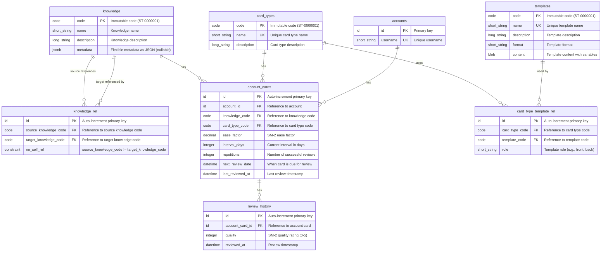
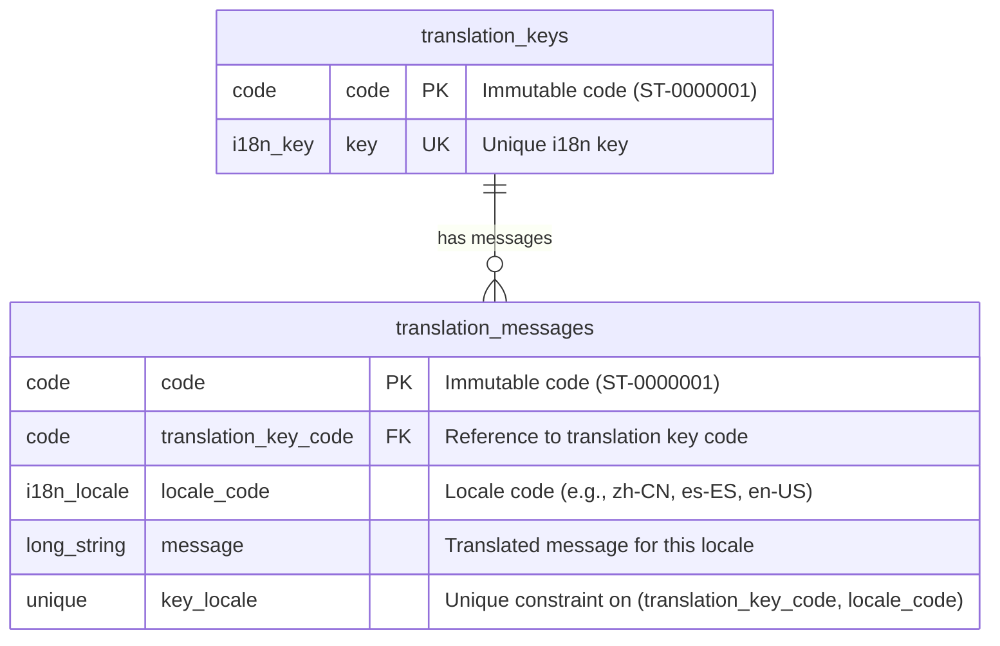

# English Learning System All in One

## Part 1: Business Overview

### System Overview
An English learning system that helps users learn vocabulary and knowledge through spaced repetition. The system uses the SM-2 algorithm to optimize learning schedules, presenting cards for review at optimal intervals. Knowledge content is managed by operators through CSV batch imports with validation and approval workflows.

### Key Features
- **Spaced Repetition Learning**: SM-2 algorithm for optimal review scheduling
- **Knowledge Management**: Predefined knowledge items organized by levels
- **Card Types**: Multiple learning patterns (e.g., word-to-definition, definition-to-word)
- **Progress Tracking**: Statistics and learning history
- **Batch Import**: CSV-based knowledge management with validation and approval

---

## Part 1.1: Client Side Operations

### Card Review Operation
1. User requests cards due for review
2. System retrieves cards where `next_review_date <= today`
3. System renders card content using templates (front and back)
4. User reviews card and submits quality rating (0-5)
5. System applies SM-2 algorithm to calculate next review date
6. System updates card state and records review history
7. User sees updated card with new review schedule

**User Actions**:
- View due cards
- Review cards
- Submit quality rating

**System Behaviors**:
- Filter cards by due date
- Render card content from templates
- Calculate optimal next review date using SM-2
- Track learning progress

### Statistics Viewing Operation
1. User requests learning statistics
2. System calculates statistics from user's cards:
   - Total cards
   - New cards (not yet reviewed)
   - Learning cards (in progress)
   - Due today
   - Breakdown by card type
3. User views progress dashboard

**User Actions**:
- View learning statistics

**System Behaviors**:
- Aggregate card statistics
- Calculate learning progress metrics
- Group by card types

## Part 1.1.1: Client Side Workflows (Temporal)

### Card Initialization Workflow
A heavy job that creates cards for all knowledge-card type combinations after user signup. This workflow is executed asynchronously using Temporal.

**Workflow Steps**:
1. User signs up for an account
2. System triggers Temporal workflow for card initialization
3. Workflow loads available knowledge items (potentially thousands)
4. Workflow loads all card types
5. Workflow creates cards in batches for each knowledge-card type combination:
   - Batch processing to avoid timeouts
   - Progress tracking for monitoring
   - Error handling and retry logic
6. Workflow creates cards with default SM-2 values
7. Workflow completes and notifies system
8. User account is ready for learning

**User Actions**:
- Sign up for account (triggers workflow)

**System Behaviors**:
- Triggers Temporal workflow asynchronously
- Workflow processes cards in batches
- Workflow provides progress updates
- Workflow handles errors and retries
- System ensures account is ready for learning

---

## Part 1.2: Operator Side Workflows (Temporal)

### Knowledge Management Workflow

A heavy job with multiple sub-tasks: CSV upload, validation, comparison, and approval. This workflow is executed using Temporal to handle long-running operations, retries, and state management.

**Workflow Steps**:

1. **Export CSV** (Optional, Simple Operation)
   - Operator exports all knowledge to CSV file
   - Exported CSV includes code column with all existing codes filled in
   - Operator can modify the CSV file (add new rows, update existing rows, remove rows)

2. **Upload CSV & Start Workflow**
   - Operator uploads modified CSV file
   - CSV format:
     - **Existing items**: Code column is filled (e.g., `ST-0000001`)
     - **New items**: Code column is empty (codes will be generated after approval)
     - **Metadata fields**: Flat columns with `metadata:` prefix (e.g., `metadata:level`, `metadata:type`)
   - System triggers Temporal workflow for knowledge import
   - Workflow stores CSV data temporarily

3. **Validation Activity** (Temporal Activity)
   - Workflow executes validation activity:
     - Validates data legality (format, required fields)
     - Parses metadata columns and converts to JSONB
     - Validates code format if provided
   - Workflow stores validation results

4. **Comparison Activity** (Temporal Activity)
   - Workflow executes comparison activity:
     - Compares CSV with existing database:
       - Uses code column to identify existing items (if code is filled)
       - Uses content matching for items without codes (to detect duplicates)
     - Identifies differences:
       - New items (code column empty, not in database)
       - Updated items (code column filled, exists in database with different data)
       - Unchanged items (code column filled, exists with same data)
       - Deleted items (in database but not in CSV)
   - Workflow stores comparison results

5. **Review & Approval** (Human-in-the-loop)
   - Operator reviews validation results and differences
   - Operator approves or rejects changes via API
   - Workflow waits for operator decision (signal)

6. **Apply Changes Activity** (Temporal Activity, if approved)
   - If approved, workflow executes apply activity:
     - Generates codes (ST-0000001, ST-0000002, etc.) for new items using CodeGenerationService
     - Applies all changes to database in batches:
       - Inserts new items with generated codes
       - Updates existing items
       - Handles deletions (if supported)
     - Progress tracking for large batches
     - Error handling and retry logic
   - If rejected, workflow completes without changes

**Key Points**:
- Export is a simple operation (not a workflow)
- Import is a Temporal workflow with multiple activities
- Workflow handles long-running operations, retries, and state management
- Validation and comparison are separate activities for better error handling
- Approval is a human-in-the-loop step (workflow waits for signal)
- Code generation happens during apply activity, after approval
- Batch processing ensures scalability for large imports

---

## Part 2: Technology Architecture

## Part 2.1: Technology Stack

### Overview
A Spring Boot reactive backend application for English knowledge learning with spaced repetition (SM-2 algorithm), supporting knowledge items and predefined card types.

### Technology Stack
- **Framework**: Spring Boot 4.0.0 with WebFlux (reactive)
- **Database**: PostgreSQL with R2DBC (reactive database access)
- **Migration**: Flyway
- **Workflow Engine**: Temporal (for heavy, multi-step workflows)
- **Language**: Kotlin
- **Build**: Gradle with Kotlin DSL

---

## Part 2.2: Code Specification

### Code Pattern Format

Predefined entities (`knowledge`, `templates`, `card_types`) use immutable short codes following a pattern format:

**Pattern**: `{PREFIX}-{NUMBER}`

Where:
- `PREFIX`: 2-letter uppercase meaningless prefix
- `NUMBER`: 7-digit zero-padded number (0000001-9999999)
- Total length: 10 characters (2 prefix + 1 hyphen + 7 digits)

### Code Prefixes

- **ST-**: Standard (e.g., `ST-0000001`, `ST-0000002`)
- **CS-**: Custom (e.g., `CS-0000001`)

All predefined entities (knowledge, templates, card_types) use these prefixes. ST- is used for standard/predefined items, CS- is reserved for custom items or future extensions.

### Code Rules

1. **Global Uniqueness**: Codes must be unique across all entity types globally
2. **Immutable**: Once assigned, codes cannot be changed
3. **Prefix Meaning**: ST- indicates standard/predefined items, CS- indicates custom items
4. **Sequential**: Numbers are assigned sequentially within each prefix
5. **Case Sensitive**: Codes are stored in uppercase

### Examples

- Standard Template: `ST-0000001`, `ST-0000002`
- Standard Card Type: `ST-0000003`, `ST-0000004`
- Standard Knowledge: `ST-0000005`, `ST-0000006`
- Custom items: `CS-0000001`, `CS-0000002` (for future use)

### Code Generation Design

**Generation Strategy**: Database sequences per prefix to ensure global uniqueness and sequential numbering.

#### Database Sequences

Each prefix requires a separate database sequence to maintain sequential numbering:

```sql
-- Sequences for code generation
CREATE SEQUENCE code_seq_st START WITH 1;  -- ST- prefix
CREATE SEQUENCE code_seq_cs START WITH 1;  -- CS- prefix
```

**Sequence Naming Convention**: `code_seq_{prefix_lowercase}`

#### Code Generation Service

A centralized `CodeGenerationService` handles code generation:

**Responsibilities**:
1. Select appropriate sequence based on prefix
2. Generate next sequential number
3. Format code according to pattern: `{PREFIX}-{NUMBER}` (10 characters total)
4. Ensure atomicity and thread-safety
5. Validate generated code format

**Implementation Pattern**:
```kotlin
@Service
class CodeGenerationService(
    private val r2dbcEntityTemplate: R2dbcEntityTemplate
) {
    suspend fun generateCode(prefix: String): String {
        require(prefix in listOf("ST", "CS")) { "Invalid prefix: $prefix" }
        require(prefix.length == 2) { "Prefix must be exactly 2 characters" }
        
        val sequenceName = "code_seq_${prefix.lowercase()}"
        val nextValue = r2dbcEntityTemplate.databaseClient
            .sql("SELECT nextval(:sequenceName)")
            .bind("sequenceName", sequenceName)
            .fetch()
            .one()
            .map { it["nextval"] as Long }
            .awaitSingle()
        
        val number = nextValue.toString().padStart(7, '0')
        require(number.length <= 7) { "Sequence value exceeds 7 digits" }
        
        return "$prefix-$number"
    }
}
```

#### Code Generation Rules

1. **Atomicity**: Use database sequences (not application-level counters) to ensure atomic increments
2. **Thread-Safety**: Database sequences are inherently thread-safe
3. **Uniqueness**: Sequences guarantee unique numbers per prefix
4. **Sequential**: Numbers are assigned sequentially within each prefix
5. **Format Validation**: Generated code must match pattern `{PREFIX}-{NUMBER}` (10 chars)
6. **Prefix Validation**: Only `ST` and `CS` prefixes are allowed
7. **Number Padding**: Numbers are zero-padded to 7 digits (0000001-9999999)

#### Code Generation Flow

```
1. Service receives prefix (ST or CS)
2. Validate prefix format and allowed values
3. Query database sequence: SELECT nextval('code_seq_{prefix}')
4. Format number: pad to 7 digits with leading zeros
5. Combine: {PREFIX}-{NUMBER}
6. Validate final code format (10 characters)
7. Return generated code
```

#### Error Handling

**Invalid Prefix**:
- Error: `IllegalArgumentException`
- Message: "Invalid prefix: {prefix}. Must be ST or CS"

**Sequence Overflow**:
- Error: `IllegalStateException`
- Message: "Sequence value exceeds maximum (9999999)"
- Prevention: Monitor sequence values, plan for prefix migration if needed

**Database Error**:
- Error: `DataAccessException`
- Handling: Retry logic or fail-fast depending on use case

#### Code Validation

Before using generated codes, validate format:

```kotlin
fun validateCode(code: String): Boolean {
    val pattern = Regex("^(ST|CS)-\\d{7}$")
    return pattern.matches(code) && code.length == 10
}
```

#### Usage in Entity Creation

**Example**: Creating a knowledge item
```kotlin
val code = codeGenerationService.generateCode("ST")
val knowledge = Knowledge(
    code = code,
    name = "Example",
    description = "Description",
    metadata = null
)
repository.save(knowledge)
```

#### Migration Considerations

**Initial Sequence Values**:
- Start sequences at 1 for new systems
- For existing data migration, set sequence start value to max existing number + 1:
  ```sql
  SELECT setval('code_seq_st', (SELECT MAX(CAST(SUBSTRING(code FROM 4) AS INTEGER)) FROM knowledge WHERE code LIKE 'ST-%'));
  ```

**Sequence Reset** (if needed):
- Use `setval()` to reset sequence to specific value
- Only during migration or maintenance, never in production

---

## Part 2.3: Data Type Definitions

### Standardized Data Types

All database fields use the following standardized semantic data type definitions based on usage patterns:

| Semantic Type | Database Type | Kotlin Type | Usage |
|--------------|---------------|-------------|-------|
| `code` | `VARCHAR(20)` | `String` | Immutable code identifiers (e.g., `ST-0000001`) |
| `short_string` | `VARCHAR(255)` | `String` | Short text fields (name, username, role) |
| `long_string` | `TEXT` | `String` | Long text fields (description, message) |
| `blob` | `BYTEA` | `ByteArray` | Binary large object fields (content) |
| `i18n_key` | `VARCHAR(100)` | `String` | i18n translation key identifiers |
| `i18n_locale` | `VARCHAR(10)` | `String` | i18n locale codes (e.g., `zh-CN`, `es-ES`) |
| `id` | `BIGSERIAL` | `Long` | Auto-increment primary keys |
| `decimal` | `DECIMAL(5,2)` | `BigDecimal` | Decimal numeric values (e.g., ease_factor) |
| `integer` | `INTEGER` | `Int` | Integer numeric values (interval_days, repetitions, quality) |
| `datetime` | `TIMESTAMP` | `LocalDateTime` | Date-time fields with time parts (next_review_date) |
| `utc_time` | `TIMESTAMP` | `Instant` | UTC timestamp fields (created_at, updated_at, reviewed_at, last_reviewed_at) |
| `jsonb` | `JSONB` | `String` | JSON metadata (requires custom converter) |

**Implementation Notes**:
- Use `@Column` annotation for snake_case to camelCase conversion
- For JSONB fields, consider using a custom converter or Jackson ObjectMapper for JSON serialization/deserialization
- Use nullable types (`String?`, `Instant?`) for nullable database fields
- R2DBC automatically handles type conversion for standard types

---

## Part 2.4: Audit Fields

### Standard Audit Fields

The following audit fields are used across tables but are not shown in the Core ER Diagram to keep it clean:

| Field Name | Semantic Type | Database Type | Kotlin Type | Description |
|------------|---------------|---------------|-------------|-------------|
| `created_at` | `utc_time` | `TIMESTAMP` | `Instant` | Creation timestamp |
| `updated_at` | `utc_time` | `TIMESTAMP` | `Instant` | Last update timestamp |
| `created_by` | `short_string` | `VARCHAR(255)` | `String` | Username or identifier of internal user who created the record |
| `updated_by` | `short_string` | `VARCHAR(255)` | `String` | Username or identifier of internal user who last updated the record |

### Audit Fields by Table

| Table | `created_at` | `updated_at` | `created_by` | `updated_by` |
|-------|--------------|--------------|---------------|---------------|
| `knowledge` | ✓ | ✓ | ✓ | ✓ |
| `templates` | ✓ | ✓ | ✓ | ✓ |
| `card_types` | ✓ | ✓ | ✓ | ✓ |
| `translation_keys` | ✓ | ✓ | ✓ | ✓ |
| `translation_messages` | ✓ | ✓ | ✓ | ✓ |
| `knowledge_rel` | ✓ | ✓ | ✓ | ✓ |
| `card_type_template_rel` | ✓ | ✓ | ✓ | ✓ |
| `accounts` | ✓ | ✓ | ✓ | ✓ |
| `account_cards` | ✓ | ✓ | ✓ | ✓ |
| `review_history` | ✓ | | ✓ | |

**Notes**:
- All timestamp audit fields use `utc_time` semantic type (`TIMESTAMP` → `Instant` in Kotlin) and are stored in UTC.
- User audit fields use `short_string` semantic type (`VARCHAR(255)` → `String` in Kotlin) to store internal user identifiers.
- `review_history` table does not have `updated_at` and `updated_by` fields as it represents immutable historical records that should not be modified after creation.
- Review-related fields (`reviewed_at`, `last_reviewed_at`) are core business fields and remain in the Core ER Diagram as they track account review actions.

---

## Part 2.5: Database Schema

### Tables

#### 1. `knowledge`
Learning unit with common fields: code (immutable primary key), name, description, and metadata (JSONB for flexible key-value data). Uses immutable code (format: `ST-0000001` for standard items) as primary key since knowledge items are predefined.

#### 2. `knowledge_rel`
Junction table for many-to-many self-referential relationship between knowledge items. Links knowledge items to other knowledge items for various reasons. Uses `source_knowledge_code` and `target_knowledge_code` to reference knowledge items. Constraint: source_knowledge_code cannot equal target_knowledge_code (no self-references).

#### 3. `templates`
Reusable templates for rendering card content. Includes format field (short_string type) to specify template format and content field (blob type) for template content. Templates support variables like {{name}}, {{description}}, {{metadata}}, and {{#related_knowledge}}. Metadata can be accessed via JSON path operators (e.g., {{metadata.key}}). A template's usage role (e.g., "front", "back", or custom roles) is determined by how it's referenced in card_type_template_rel, not by a type field. Templates can be reused across different card types in different roles for flexibility. Uses immutable code (format: `ST-0000001` for standard templates) as primary key since templates are predefined.

#### 3. `card_types`
Predefined card patterns that reference templates for rendering. Each card type defines a learning pattern (e.g., "word_to_definition", "definition_to_word") and can reference multiple templates in different roles (e.g., "front", "back", or custom roles). Uses immutable code (format: `ST-0000001` for standard card types) as primary key since card types are predefined.

#### 3. `card_type_template_rel`
Junction table for flexible many-to-many relationship between card_types and templates. Links card types to templates with a role field indicating how the template is used (e.g., "front", "back").

#### 4. `translation_keys`
Translation key entries using i18n pattern. Each translation key has a unique key. Uses immutable code (format: `ST-0000001` for standard keys) as primary key since translation keys are predefined.

#### 5. `translation_messages`
Translation message entries for each locale. Each translation key can have multiple messages (one per locale_code). References translation_keys via foreign key. The combination of `translation_key_code` and `locale_code` is unique. Uses immutable code (format: `ST-0000001` for standard messages) as primary key since translation messages are predefined.

#### 6. `accounts`
Account records (simplified for MVP). Stores basic account information including username. Distinguishes end-user accounts from internal users who operate the product.

#### 7. `account_cards`
Account's learning progress for each knowledge-card type combination. Tracks SM-2 algorithm state including ease factor, interval days, repetitions, and next review date. Each account can have one card per knowledge-card type combination (enforced by unique constraint). References knowledge via `knowledge_code` foreign key.

#### 8. `review_history`
Historical record of reviews (optional, for analytics). Stores each review with quality rating (0-5) and timestamp for tracking learning progress over time. References account_cards via foreign key.

#### 9. `knowledge_import_sessions`
Temporary storage for CSV import sessions. Stores uploaded CSV data, validation results, and approval status. Used for batch knowledge import workflow with operator review and approval. Sessions are created during CSV upload, validated, then approved or rejected. Once approved, changes are applied to knowledge table and session can be archived or deleted.

### Core ER Diagram



### Translation ER Diagram



### Relationships
- One card_type ↔ multiple templates (many-to-many via card_type_template_rel junction table with role field)
- One template → can be used by multiple card_types in different roles
- One knowledge ↔ multiple knowledge (many-to-many self-referential via knowledge_rel junction table, no self-references allowed)
- One translation key → can have multiple translation messages (one per locale_code), with unique constraint on (translation_key_code, locale_code)
- One knowledge → multiple account_cards (one per account per card type)
- One account → multiple account_cards (one per knowledge per card type)
- One account_card → multiple review_history entries

**Constraints**:
- Each knowledge item has name and description fields
- Metadata field is JSONB type for flexible key-value storage
- Recommended: Create GIN index on metadata field for efficient querying: `CREATE INDEX idx_knowledge_metadata_gin ON knowledge USING GIN (metadata);`
- Knowledge_rel table: source_knowledge_code cannot equal target_knowledge_code (no self-references)
- Each account_card references a knowledge_code
- Each account_card tracks SM-2 algorithm state independently
- Translation_keys table has unique constraint on key
- Translation_messages table has unique constraint on (translation_key_code, locale_code)

### Metadata Query Examples

Knowledge items can be queried by metadata using JSONB operators:

- **Key exists**: `WHERE metadata ? 'key'`
- **Value match**: `WHERE metadata->>'key' = 'value'`
- **Containment**: `WHERE metadata @> '{"key": "value"}'`
- **Nested access**: `WHERE metadata->'nested'->>'key' = 'value'`

For optimal performance, create a GIN index on the metadata column:
```sql
CREATE INDEX idx_knowledge_metadata_gin ON knowledge USING GIN (metadata);
```

## Part 2.6: API Design

### Design Principles

This API follows:
- **Single Responsibility Principle (SRP)**: Each endpoint has a single, well-defined responsibility
- **Google API Design Guidelines**: Resource-oriented design, consistent naming, standard patterns
- **Unified API with Role-Based Access**: Single API surface with access control via headers

### Base Path: `/api/v1`

### Resource Naming Conventions

- Use plural nouns for collection resources: `knowledge`, `card-types`, `accounts`, `cards`
- Use resource identifiers in paths: `/knowledge/{code}`, `/accounts/{accountId}/cards/{cardId}`
- Use custom actions with `:` prefix: `:initialize`, `:review`
- Use consistent field naming: camelCase in JSON, snake_case in query parameters

### API Access Control

The API uses a unified path structure with role-based access control via JWT token claims:

**Unified Path Structure**:
- All endpoints use the same paths regardless of user role
- No separate `/ops/` or `/clients/` path prefixes needed
- Role is extracted from JWT token claims (`role` or `roles` claim) to determine access permissions
- Same endpoints serve both roles, but permissions differ based on role from token

**Token-Based Role Access Control**:
- `Authorization: Bearer <token>` header contains JWT with role claim
- Role values:
  - `operator`: Internal operators managing the system (full CRUD access)
  - `client`: End-user accounts using the learning system (read/action access)
- Client endpoints use `/me` pattern for authenticated user context (account ID from token `sub` claim)
- Operators can access any account via `{accountId}` pattern

**JWT Token Structure**:
```json
{
  "sub": "account-id-or-user-id",
  "role": "client",  // or "operator"
  "iat": 1234567890,
  "exp": 1234567890
}
```

**Benefits of Unified Path Approach**:
- Single API surface, simpler routing and maintenance
- Consistent resource structure regardless of user type
- No path-based separation needed (role determines access)
- Less code duplication
- Easier to maintain consistency
- Role-based access control at the security layer
- More secure (role cannot be spoofed, it's part of signed token)

**Security Implementation**:
- Role is validated from JWT token claims during authentication
- Access control is enforced at the security layer based on token role
- Token signature ensures role cannot be tampered with
- Same endpoint paths, different permissions based on role

---

## Unified API Endpoints

**Base Path**: `/api/v1`

All endpoints are unified under a single path structure. Access control and behavior are determined by the role claim in the `Authorization` JWT token.

### Knowledge Endpoints

**Access**: Both `operator` and `client` roles (read-only for clients, full CRUD for operators)

#### `GET /api/v1/knowledge`
List knowledge items with optional filtering.

**Headers**:
- `Authorization: Bearer <token>` (required, token must have `role: client` or `role: operator` claim)

**Query Parameters**:
- `page` (optional, default: 0): Page number (0-indexed)
- `size` (optional, default: 20, max: 100): Number of items per page
- `filter` (optional): Filter expression (e.g., `metadata.key = 'value'`)

**Response**: `200 OK`
```json
{
  "content": [
    {
      "code": "ST-0000001",
      "name": "Example",
      "description": "Description",
      "metadata": {}
    }
  ],
  "page": {
    "number": 0,
    "size": 20,
    "totalElements": 100,
    "totalPages": 5
  }
}
```

**Errors**:
- `401 Unauthorized`: Missing or invalid token
- `400 Bad Request`: Invalid filter expression or size > 100
- `500 Internal Server Error`: Server error

#### `GET /api/v1/knowledge/{code}`
Get a specific knowledge item.

**Headers**:
- `Authorization: Bearer <token>` (required, token must have `role: client` or `role: operator` claim)

**Path Parameters**:
- `code` (required): Knowledge code identifier

**Response**: `200 OK`
```json
{
  "code": "ST-0000001",
  "name": "Example",
  "description": "Description",
  "metadata": {}
}
```

**Errors**:
- `401 Unauthorized`: Missing or invalid token
- `404 Not Found`: Knowledge not found
- `400 Bad Request`: Invalid code format

#### `GET /api/v1/knowledge:export`
Export all knowledge items to CSV file.

**Headers**:
- `Authorization: Bearer <token>` (required, token must have `role: operator` claim)

**Response**: `200 OK`
- Content-Type: `text/csv`
- CSV file with columns: `code`, `name`, `description`, `metadata`
- All codes are filled in for existing items

**CSV Format** (exported):
```csv
code,name,description,metadata:level,metadata:type
ST-0000001,Example 1,Description 1,A1,vocabulary
ST-0000002,Example 2,Description 2,A2,phrase
```

#### `POST /api/v1/knowledge:upload`
Upload CSV file for batch knowledge import.

**Headers**:
- `Authorization: Bearer <token>` (required, token must have `role: operator` claim)
- `Content-Type: multipart/form-data`

**Request Body** (multipart/form-data):
- `file` (required): CSV file with columns: `code` (optional), `name`, `description`, `metadata:*` (optional, any number of metadata columns)

**CSV Format** (for import):
```csv
code,name,description,metadata:level,metadata:type
ST-0000001,Updated Example 1,Updated Description 1,A1,vocabulary
,New Example 2,New Description 2,A2,phrase
ST-0000003,Another Updated,Another Description,B1,idiom
```

**Column Rules**:
- **Code column**: Optional
  - **Filled code** (e.g., `ST-0000001`): Identifies existing item for update
  - **Empty code**: Identifies new item (code will be generated after approval)
  - Codes are validated if provided (must match format `{PREFIX}-{NUMBER}`)
- **Metadata columns**: Optional, flat structure with `metadata:` prefix
  - Any number of metadata columns can be included (e.g., `metadata:level`, `metadata:type`, `metadata:difficulty`)
  - Values are stored as strings in JSONB metadata object
  - Example: `metadata:level=A1` becomes `{"level": "A1"}` in database

**Response**: `202 Accepted`
```json
{
  "sessionId": "uuid-string",
  "status": "pending_validation",
  "uploadedAt": "2024-01-01T12:00:00Z"
}
```

**Errors**:
- `401 Unauthorized`: Missing or invalid token
- `403 Forbidden`: Token does not have `operator` role claim
- `400 Bad Request`: Invalid CSV format or missing required columns

#### `POST /api/v1/knowledge:validate`
Validate uploaded CSV and compare with existing data.

**Headers**:
- `Authorization: Bearer <token>` (required, token must have `role: operator` claim)

**Request Body**:
```json
{
  "sessionId": "uuid-string"
}
```

**Response**: `200 OK`
```json
{
  "sessionId": "uuid-string",
  "status": "validated",
  "summary": {
    "total": 100,
    "new": 20,
    "updated": 15,
    "unchanged": 60,
    "deleted": 5,
    "errors": 0
  },
  "changes": {
    "new": [
      { "name": "New Item", "description": "...", "metadata": {"level": "A1", "type": "vocabulary"} }
    ],
    "updated": [
      { "code": "ST-0000002", "old": {...}, "new": {...} }
    ],
    "unchanged": [
      { "code": "ST-0000003", "name": "Existing Item", ... }
    ],
    "deleted": ["ST-0000005"]
  },
  "errors": []
}
```

**Note**: 
- New items (code column was empty) do not include codes in response. Codes will be generated after approval.
- Updated/unchanged items (code column was filled) include their codes.
- Metadata columns with `metadata:` prefix are converted to JSONB object in database.

**Errors**:
- `401 Unauthorized`: Missing or invalid token
- `403 Forbidden`: Token does not have `operator` role claim
- `404 Not Found`: Import session not found
- `400 Bad Request`: Session not in valid state for validation

#### `POST /api/v1/knowledge:approve`
Approve or reject validated import changes.

**Headers**:
- `Authorization: Bearer <token>` (required, token must have `role: operator` claim)

**Request Body** (approve):
```json
{
  "sessionId": "uuid-string",
  "approved": true
}
```

**Request Body** (reject):
```json
{
  "sessionId": "uuid-string",
  "approved": false,
  "reason": "Reason for rejection"
}
```

**Response** (approve): `200 OK`
```json
{
  "sessionId": "uuid-string",
  "status": "approved",
  "applied": {
    "new": 20,
    "updated": 15,
    "deleted": 5
  },
  "generatedCodes": [
    { "name": "New Item 1", "code": "ST-0000001" },
    { "name": "New Item 2", "code": "ST-0000002" }
  ],
  "approvedAt": "2024-01-01T12:00:00Z",
  "approvedBy": "operator-id"
}
```

**Note**: `generatedCodes` array contains the codes that were automatically generated for new items during approval.

**Response** (reject): `200 OK`
```json
{
  "sessionId": "uuid-string",
  "status": "rejected",
  "rejectedAt": "2024-01-01T12:00:00Z",
  "rejectedBy": "operator-id",
  "reason": "Reason for rejection"
}
```

**Errors**:
- `401 Unauthorized`: Missing or invalid token
- `403 Forbidden`: Token does not have `operator` role claim
- `404 Not Found`: Import session not found
- `400 Bad Request`: Session not in `validated` status or invalid request body

### Card Types Endpoints

**Access**: Both `operator` and `client` roles (read-only)

#### `GET /api/v1/card-types`
List all available card types.

**Headers**:
- `Authorization: Bearer <token>` (required, token must have `role: client` or `role: operator` claim)

**Query Parameters**:
- `page` (optional, default: 0): Page number (0-indexed)
- `size` (optional, default: 20, max: 100): Number of items per page

**Response**: `200 OK`
```json
{
  "content": [
    {
      "code": "ST-0000001",
      "name": "word_to_definition",
      "description": "Card type description"
    }
  ],
  "page": {
    "number": 0,
    "size": 20,
    "totalElements": 5,
    "totalPages": 1
  }
}
```

**Errors**:
- `401 Unauthorized`: Missing or invalid token
- `400 Bad Request`: Invalid size > 100

#### `GET /api/v1/card-types/{code}`
Get a specific card type.

**Headers**:
- `Authorization: Bearer <token>` (required, token must have `role: client` or `role: operator` claim)

**Path Parameters**:
- `code` (required): Card type code identifier

**Response**: `200 OK`
```json
{
  "code": "ST-0000001",
  "name": "word_to_definition",
  "description": "Card type description"
}
```

**Errors**:
- `401 Unauthorized`: Missing or invalid token
- `404 Not Found`: Card type not found
- `400 Bad Request`: Invalid code format

### Account Card Endpoints

**Access**: `client` role (for `/me` endpoints) or `operator` role (for `{accountId}` endpoints)

#### `GET /api/v1/accounts/me/cards`
List current account's cards with optional filtering.

**Headers**:
- `Authorization: Bearer <token>` (required, token must have `role: client` claim and `sub` claim with account ID)

**Query Parameters**:
- `card_type_code` (optional): Filter by card type code
- `status` (optional): Filter by status (`new`, `learning`, `review`, `all`)
  - `new`: repetitions = 0
  - `learning`: repetitions > 0 and < 3
  - `review`: next_review_date <= today
  - `all`: No status filter (default)
- `page` (optional, default: 0): Page number (0-indexed)
- `size` (optional, default: 20, max: 100): Number of items per page

**Response**: `200 OK`
```json
{
  "content": [
    {
      "id": 1,
      "knowledge": { "code": "ST-0000001", "name": "Example", ... },
      "cardType": { "code": "ST-0000001", "name": "word_to_definition", ... },
      "easeFactor": 2.5,
      "intervalDays": 1,
      "repetitions": 0,
      "nextReviewDate": "2024-01-01T00:00:00Z",
      "lastReviewedAt": null
    }
  ],
  "page": {
    "number": 0,
    "size": 20,
    "totalElements": 50,
    "totalPages": 3
  }
}
```

**Errors**:
- `401 Unauthorized`: Missing or invalid token
- `403 Forbidden`: Token does not have `client` role claim
- `400 Bad Request`: Invalid status value or size > 100

#### `GET /api/v1/accounts/{accountId}/cards`
List specific account's cards (operator access).

**Headers**:
- `Authorization: Bearer <token>` (required, token must have `role: operator` claim)

**Path Parameters**:
- `accountId` (required): Account identifier

**Query Parameters**: Same as `/me/cards` endpoint

**Response**: Same format as `/me/cards`

**Errors**:
- `401 Unauthorized`: Missing or invalid token
- `403 Forbidden`: Token does not have `operator` role claim
- `404 Not Found`: Account not found

#### `GET /api/v1/accounts/me/cards/{cardId}`
Get a specific card for current account.

**Headers**:
- `Authorization: Bearer <token>` (required, token must have `role: client` claim and `sub` claim with account ID)

**Path Parameters**:
- `cardId` (required): Card identifier

**Response**: `200 OK`
```json
{
  "id": 1,
  "knowledge": { "code": "ST-0000001", "name": "Example", ... },
  "cardType": { "code": "ST-0000001", "name": "word_to_definition", ... },
  "easeFactor": 2.5,
  "intervalDays": 1,
  "repetitions": 0,
  "nextReviewDate": "2024-01-01T00:00:00Z",
  "lastReviewedAt": null
}
```

**Errors**:
- `401 Unauthorized`: Missing or invalid token
- `403 Forbidden`: Token does not have `client` role claim
- `404 Not Found`: Card not found
- `403 Forbidden`: Card does not belong to current account (account ID from token `sub` claim)

#### `GET /api/v1/accounts/me/cards:due`
Get cards due for review for current account.

**Headers**:
- `Authorization: Bearer <token>` (required, token must have `role: client` claim and `sub` claim with account ID)

**Query Parameters**:
- `card_type_code` (optional): Filter by specific card type code
- `page` (optional, default: 0): Page number (0-indexed)
- `size` (optional, default: 20, max: 100): Maximum number of cards to return

**Response**: `200 OK`
```json
{
  "content": [
    {
      "id": 1,
      "knowledge": { "code": "ST-0000001", "name": "Example", ... },
      "cardType": { "code": "ST-0000001", "name": "word_to_definition", ... },
      "front": "Rendered front content",
      "back": "Rendered back content",
      "easeFactor": 2.5,
      "intervalDays": 1,
      "repetitions": 0,
      "nextReviewDate": "2024-01-01T00:00:00Z"
    }
  ],
  "page": {
    "number": 0,
    "size": 20,
    "totalElements": 10,
    "totalPages": 1
  }
}
```

**Errors**:
- `401 Unauthorized`: Missing or invalid token
- `403 Forbidden`: Token does not have `client` role claim
- `400 Bad Request`: Invalid size > 100

#### `POST /api/v1/accounts/me/cards:initialize` (Internal/Admin Use)
Initialize cards for current account. This endpoint is typically called automatically during account signup, but can also be used manually if needed.

**Headers**:
- `Authorization: Bearer <token>` (required, token must have `role: client` claim and `sub` claim with account ID)

**Request Body**:
```json
{
  "cardTypeCodes": ["ST-0000001", "ST-0000002"]
}
```
- `cardTypeCodes` (optional): If not provided, initializes cards for all card types

**Response**: `200 OK`
```json
{
  "created": 50,
  "skipped": 10
}
```

**Behavior**: Creates account_cards for all knowledge items and specified card types (or all card types if not specified) that don't already exist for the account. Called automatically during signup.

**Errors**:
- `401 Unauthorized`: Missing or invalid token
- `403 Forbidden`: Token does not have `client` role claim
- `400 Bad Request`: Invalid card type codes

#### `POST /api/v1/accounts/me/cards/{cardId}:review`
Submit a review result and update SM-2 algorithm state.

**Headers**:
- `Authorization: Bearer <token>` (required, token must have `role: client` claim and `sub` claim with account ID)

**Path Parameters**:
- `cardId` (required): Card identifier

**Request Body**:
```json
{
  "quality": 3
}
```

**Quality Values**:
- `0` = again (complete blackout)
- `1` = hard
- `2` = good
- `3` = easy
- `4` = very easy
- `5` = perfect

**Response**: `200 OK`
```json
{
  "id": 1,
  "knowledge": { "code": "ST-0000001", ... },
  "cardType": { "code": "ST-0000001", ... },
  "easeFactor": 2.6,
  "intervalDays": 2,
  "repetitions": 1,
  "nextReviewDate": "2024-01-03T00:00:00Z",
  "lastReviewedAt": "2024-01-01T12:00:00Z"
}
```

**Errors**:
- `401 Unauthorized`: Missing or invalid token
- `403 Forbidden`: Token does not have `client` role claim
- `400 Bad Request`: Invalid quality value (not 0-5)
- `404 Not Found`: Card not found
- `403 Forbidden`: Card does not belong to current account (account ID from token `sub` claim)

### Statistics Endpoints

#### `GET /api/v1/accounts/me/stats`
Get learning statistics for current account.

**Headers**:
- `Authorization: Bearer <token>` (required, token must have `role: client` claim and `sub` claim with account ID)

**Response**: `200 OK`
```json
{
  "totalCards": 100,
  "newCards": 20,
  "learningCards": 30,
  "dueToday": 15,
  "byCardType": {
    "ST-0000001": 50,
    "ST-0000002": 50
  }
}
```

**Errors**:
- `401 Unauthorized`: Not authenticated

### Error Responses

All endpoints follow standard HTTP status codes and Google API error format:

**Standard HTTP Status Codes**:
- `200 OK`: Success
- `400 Bad Request`: Invalid request parameters or body
- `403 Forbidden`: Resource exists but access denied
- `404 Not Found`: Resource not found
- `500 Internal Server Error`: Server error
- `503 Service Unavailable`: Service temporarily unavailable

**Error Response Format** (following Google API Design Guidelines):
```json
{
  "error": {
    "code": 404,
    "message": "Card not found",
    "status": "NOT_FOUND",
    "details": [
      {
        "@type": "type.googleapis.com/google.rpc.ErrorInfo",
        "reason": "CARD_NOT_FOUND",
        "domain": "english-learning.api",
        "metadata": {
          "cardId": "123",
          "accountId": "456"
        }
      }
    ]
  }
}
```

**Simplified Error Format** (for MVP):
```json
{
  "error": {
    "code": "NOT_FOUND",
    "message": "Card not found",
    "details": {
      "resource": "card",
      "resourceId": "123"
    }
  }
}
```

---

## Part 2.7: Service Layer Architecture

### Components

#### 0. **ReactivePaginationHelper** (Utility Service)
Reusable utility service that encapsulates R2DBC pagination pattern. Provides `paginate()` method that combines `Flux<T>` data query and `Mono<Long>` count query into `Mono<Page<T>>`. Used by all services that need pagination to eliminate boilerplate code.

#### 1. **Sm2Algorithm** (Object)
Implements the SM-2 spaced repetition algorithm.
- `calculateNextReview(currentCard, quality)`: Updates card state based on quality rating
- `createInitialCard(accountId, knowledgeCode, cardTypeCode)`: Creates new card with default SM-2 values

**SM-2 Algorithm Logic**:
- Quality < 3 (Failed): Reset repetitions to 0, interval to 1 day, decrease ease factor by 0.2
- Quality >= 3 (Passed): Increase repetitions, calculate new interval based on ease factor
- Ease factor adjustment: Based on quality rating (0-5 scale)
- Minimum ease factor: 1.3

#### 2. **TemplateService**
Manages template operations.
- `getTemplateByCode(code)`: Get single template
- `getAllTemplates()`: List all templates (usage determined by relationships)

#### 3. **CardTemplateService**
Renders card templates with knowledge data.
- `renderByRole(cardType, knowledge, role)`: Generates content using template for specified role
- Loads templates from database via TemplateService and card_type_template_rel
- Template variables: `{{name}}`, `{{description}}`, `{{metadata}}`, `{{#related_knowledge}}...{{/related_knowledge}}` (iterates over referenced knowledge entities via knowledge_rel). Metadata can be accessed via JSON path (e.g., `{{metadata.key}}` or `{{metadata.nested.key}}`).

#### 4. **KnowledgeService**
Manages knowledge operations.
- `getKnowledge(pageable: Pageable, filter?)`: List knowledge items with pagination (returns `Mono<Page<Knowledge>>`)
- `getKnowledgeByCode(code)`: Get single knowledge item (returns `Mono<Knowledge>`)

#### 4.1. **KnowledgeImportService**
Manages CSV-based batch import/export of knowledge items. Export is a simple operation, while import uses Temporal workflows.
- `exportAllKnowledge()`: Export all knowledge items to CSV file (returns `Flux<ByteArray>` or `Mono<Resource>`) - Simple operation
- `uploadCsv(file: MultipartFile, operatorId: String)`: Upload CSV file and start Temporal workflow (returns `Mono<WorkflowExecution>`)
- `getWorkflowStatus(workflowId: String)`: Get workflow status and results (returns `Mono<WorkflowStatus>`)
- `approveWorkflow(workflowId: String, approved: Boolean, reason: String?, operatorId: String)`: Send approval signal to workflow (returns `Mono<Void>`)

#### 4.2. **KnowledgeImportWorkflow** (Temporal Workflow)
Temporal workflow for knowledge import with multiple activities:
- `validateActivity(csvData: String)`: Validates CSV data format and content (Temporal Activity)
- `compareActivity(csvData: String)`: Compares CSV with existing database (Temporal Activity)
- `applyChangesActivity(changes: ImportChanges, approved: Boolean)`: Applies changes to database in batches (Temporal Activity)
- Workflow waits for approval signal from operator
- Handles retries, timeouts, and error recovery

**Import Session States**:
- `pending_validation`: CSV uploaded, awaiting validation
- `validated`: Validation complete, awaiting approval
- `approved`: Changes approved and applied to database
- `rejected`: Changes rejected by operator

#### 5. **CardTypeService**
Manages card type operations.
- `getAllCardTypes()`: List all card types (includes template references)
- `getCardTypeByCode(code)`: Get single card type with templates loaded

#### 6. **AccountCardService**
Manages account card operations and reviews.
- `initializeCards(accountId, request)`: Start Temporal workflow for card initialization (returns `Mono<WorkflowExecution>`) - Triggers workflow
- `getDueCards(accountId, pageable: Pageable, cardTypeCode?)`: Get cards due for review (returns `Mono<Page<AccountCard>>`) - Simple operation
- `reviewCard(accountId, cardId, request)`: Process review and update SM-2 state (returns `Mono<AccountCard>`) - Simple operation
- `getAccountCards(accountId, pageable: Pageable, cardTypeCode?, status?)`: List account cards with filters (returns `Mono<Page<AccountCard>>`) - Simple operation

#### 6.1. **CardInitializationWorkflow** (Temporal Workflow)
Temporal workflow for initializing cards after account creation:
- `loadKnowledgeActivity()`: Loads all knowledge items (Temporal Activity)
- `loadCardTypesActivity()`: Loads all card types (Temporal Activity)
- `createCardsActivity(accountId: String, knowledgeItems: List<Knowledge>, cardTypes: List<CardType>)`: Creates cards in batches (Temporal Activity)
- Processes cards in batches to avoid timeouts
- Provides progress updates
- Handles retries and error recovery

#### 7. **StatsService**
Calculates account statistics.
- `getStats(userId)`: Get comprehensive learning statistics

---

## Part 2.8: Data Flow & Component Interactions

### Card Review Flow
1. Client requests due cards: `GET /api/v1/accounts/me/cards:due`
   - Headers: `Authorization: Bearer <token>` (with `role: client` claim)
   - Query params: `card_type_code` (optional), `page`, `size`
2. Service validates JWT token and extracts account ID from `sub` claim
3. Service queries `account_cards` where `account_id = {accountId}` and `next_review_date <= today`
4. For each card, service loads:
   - Knowledge item (via account_card.knowledge_code)
   - Related knowledge items via knowledge_rel junction table
   - Card type and its associated templates via card_type_template_rel (with roles)
   - Templates for each role (e.g., "front", "back", or custom roles)
5. Service renders content using card templates by role (which may include {{name}}, {{description}}, and {{#related_knowledge}})
6. Service returns paginated list with rendered `front` and `back` content
7. Client displays card front to user
8. User reviews and submits quality: `POST /api/v1/accounts/me/cards/{cardId}:review`
   - Headers: `Authorization: Bearer <token>` (with `role: client` claim)
   - Body: `{ "quality": 0-5 }`
9. Service validates token and extracts account ID
10. Service verifies card belongs to account (account_card.account_id matches token `sub`)
11. Service applies SM-2 algorithm to calculate new state
12. Service saves updated `account_card` and creates `review_history` entry
13. Service returns updated card with new SM-2 state and `next_review_date`

### Card Initialization Flow (Temporal Workflow)
1. User signs up for account (account creation)
2. System automatically triggers Temporal workflow for card initialization
3. Workflow starts and executes activities:
   - `loadKnowledgeActivity()`: Loads all knowledge items from database
   - `loadCardTypesActivity()`: Loads all card types from database
4. Workflow executes `createCardsActivity()`:
   - Processes knowledge-card type combinations in batches
   - For each combination:
     - Check if account_card already exists (account_id, knowledge_code, card_type_code)
     - If not, create new account_card with default SM-2 values
   - Provides progress updates during batch processing
5. Workflow completes and notifies system
6. System completes account setup with initialized cards
7. User can immediately start learning

**Note**: Card initialization happens automatically during signup via Temporal workflow. The workflow handles large batches, retries, and error recovery. The `POST /api/v1/accounts/me/cards:initialize` endpoint exists for manual re-initialization if needed, but is not part of the normal user workflow.

### Knowledge Retrieval Flow (Client)
1. Client requests knowledge items: `GET /api/v1/knowledge`
   - Headers: `Authorization: Bearer <token>` (with `role: client` or `role: operator` claim)
   - Query params: `page`, `size`, `filter` (optional)
2. Service validates JWT token
3. Service queries `knowledge` table with pagination
4. Service applies filters if provided (metadata queries)
5. Service returns paginated list of knowledge items

### Knowledge Export Flow (Operator) - Simple Operation
1. Operator requests export: `GET /api/v1/knowledge:export`
   - Headers: `Authorization: Bearer <token>` (with `role: operator` claim)
2. Service validates JWT token and checks for `operator` role
3. Service queries all knowledge items from database
4. Service generates CSV file with columns: `code`, `name`, `description`, plus flat metadata columns (`metadata:*`)
   - Converts JSONB metadata object to flat columns with `metadata:` prefix
   - Example: `{"level": "A1", "type": "vocabulary"}` becomes columns `metadata:level`, `metadata:type`
5. Service returns CSV file: `200 OK` with `Content-Type: text/csv`
6. Operator downloads and modifies CSV file (adds new rows, updates existing rows, removes rows)

### Knowledge Import Flow (Operator) - Temporal Workflow
1. Operator uploads CSV: `POST /api/v1/knowledge:upload`
   - Headers: `Authorization: Bearer <token>` (with `role: operator` claim)
   - Content-Type: `multipart/form-data`
   - Body: CSV file
2. Service validates JWT token and checks for `operator` role
3. Service starts Temporal workflow: `KnowledgeImportWorkflow`
   - Returns workflow execution ID: `202 Accepted`
4. **Workflow: Validation Activity**
   - Workflow executes `validateActivity()`:
     - Validates data types and formats
     - Validates required fields are present (`name`, `description`)
     - Validates code format if code column is filled (must match `{PREFIX}-{NUMBER}` pattern)
     - Parses metadata columns (columns starting with `metadata:`) and converts to JSONB structure
     - Reports validation errors
5. **Workflow: Comparison Activity**
   - Workflow executes `compareActivity()`:
     - Compares CSV data with existing database:
       - **For rows with code filled**: Look up by code in database
         - If code exists: Compare data to determine if updated or unchanged
         - If code doesn't exist: Error (invalid code)
       - **For rows with empty code**: Match by content (name/description)
         - If match found: Treat as update (use existing code from database)
         - If no match: Treat as new item (code will be generated)
       - **Deleted items**: Items in database but not in CSV (if deletion is supported)
   - Workflow stores comparison results
6. **Workflow: Wait for Approval Signal**
   - Workflow waits for operator approval signal
   - Operator reviews results and approves/rejects: `POST /api/v1/knowledge:approve`
     - Body: `{ "workflowId": "uuid", "approved": true }`
7. **Workflow: Apply Changes Activity** (if approved)
   - Workflow executes `applyChangesActivity()`:
     - Generates codes for new items using `CodeGenerationService`
     - Applies changes in batches:
       - Inserts new items with generated codes
       - Updates existing items
       - Handles deletions (if supported)
     - Provides progress updates
     - Handles retries and error recovery
8. Workflow completes and notifies system
9. Operator can query workflow status: `GET /api/v1/knowledge:import-status/{workflowId}`

### Knowledge Import Approval Flow (Operator) - Temporal Signal
1. Operator reviews workflow results and approves: `POST /api/v1/knowledge:approve`
   - Headers: `Authorization: Bearer <token>` (with `role: operator` claim)
   - Body: `{ "workflowId": "uuid", "approved": true, "reason": "optional" }`
2. Service validates JWT token and checks for `operator` role
3. Service sends approval signal to Temporal workflow
4. Workflow receives signal and continues execution:
   - If approved: Executes `applyChangesActivity()` (see step 7 in Knowledge Import Flow)
   - If rejected: Workflow completes without changes
5. Service returns signal acknowledgment: `200 OK`
   ```json
   {
     "workflowId": "uuid",
     "signalSent": true,
     "timestamp": "2024-01-01T12:00:00Z"
   }
   ```
6. Operator can query workflow status to see final results: `GET /api/v1/knowledge:import-status/{workflowId}`
   ```json
   {
     "sessionId": "uuid",
     "status": "approved",
     "applied": {
       "new": 20,
       "updated": 15,
       "deleted": 5
     },
     "generatedCodes": [
       { "name": "New Item 1", "code": "ST-0000001" },
       { "name": "New Item 2", "code": "ST-0000002" }
     ],
     "approvedAt": "2024-01-01T12:00:00Z",
     "approvedBy": "operator-id"
   }
   ```

**Note**: Codes (ST-0000001, ST-0000002, etc.) are automatically generated by the system only after approval, not during upload or validation.

### Knowledge Import Rejection Flow (Operator)
1. Operator rejects changes: `POST /api/v1/knowledge:approve`
   - Headers: `Authorization: Bearer <token>` (with `role: operator` claim)
   - Body: `{ "sessionId": "uuid", "approved": false, "reason": "..." }`
2. Service validates JWT token and checks for `operator` role
3. Service loads import session
4. Service updates import session status to `rejected` with reason
5. Service returns rejection result: `200 OK`
   ```json
   {
     "sessionId": "uuid",
     "status": "rejected",
     "rejectedAt": "2024-01-01T12:00:00Z",
     "rejectedBy": "operator-id",
     "reason": "..."
   }
   ```

### Statistics Retrieval Flow (Client)
1. Client requests statistics: `GET /api/v1/accounts/me/stats`
   - Headers: `Authorization: Bearer <token>` (with `role: client` claim)
2. Service validates JWT token and extracts account ID from `sub` claim
3. Service queries `account_cards` for account:
   - Count total cards
   - Count new cards (repetitions = 0)
   - Count learning cards (repetitions > 0 and < 3)
   - Count due today (next_review_date <= today)
   - Group by card_type_code
4. Service returns statistics object: `200 OK`

---

## Part 2.9: Implementation Details

### Repository Layer
All repositories extend `ReactiveCrudRepository` for reactive database access:

**Standard Repositories**:
- `KnowledgeRepository`: CRUD operations + `findAll(Pageable)` for pagination
- `KnowledgeRelRepository`: CRUD + `findBySourceKnowledgeCode()`, `findByTargetKnowledgeCode()`
- `TranslationKeyRepository`: CRUD + `findByKey()`
- `TranslationMessageRepository`: CRUD + `findByTranslationKeyCode()`, `findByTranslationKeyCodeAndLocaleCode()`, `findByLocaleCode()`
- `TemplateRepository`: CRUD + `findByName()`
- `CardTypeRepository`: CRUD + `findByName()`
- `CardTypeTemplateRelRepository`: CRUD + `findByCardTypeCode()`, `findByTemplateCode()`, `findByCardTypeCodeAndRole()`
- `AccountRepository`: CRUD + `findByUsername()`
- `AccountCardRepository`: CRUD + custom queries for due cards, counts by status, etc.
- `ReviewHistoryRepository`: CRUD + `findByAccountCardId()`

**R2DBC Pagination Notes**:
- R2DBC supports `Pageable` as a parameter in repository methods
- Repository methods return `Flux<T>` (not `Page<T>`) for reactive streams
- To improve developer experience, use `ReactivePaginationHelper` utility (see below) to simplify pagination

#### **ReactivePaginationHelper** (Utility Service)
A reusable utility service that encapsulates the pagination pattern to improve developer experience:

```kotlin
@Service
class ReactivePaginationHelper {
    fun <T> paginate(
        data: Flux<T>,
        count: Mono<Long>,
        pageable: Pageable
    ): Mono<Page<T>> {
        return Mono.zip(data.collectList(), count)
            .map { (items, total) -> 
                PageImpl(items, pageable, total) 
            }
    }
    
    fun <T> paginateWithQuery(
        dataQuery: Flux<T>,
        countQuery: Mono<Long>,
        pageable: Pageable
    ): Mono<Page<T>> {
        return paginate(dataQuery, countQuery, pageable)
    }
}
```

**Usage in Services**:
```kotlin
fun findAll(pageable: Pageable): Mono<Page<Knowledge>> {
    return paginationHelper.paginate(
        repository.findAll(pageable),
        repository.count(),
        pageable
    )
}
```

This utility eliminates boilerplate and provides a clean, reusable pattern for pagination across all services.

### Entity Models
All entities use Spring Data R2DBC annotations:
- `@Table`: Maps to database table
- `@Id`: Primary key
- `@Column`: Maps to database column (for snake_case conversion)

### DTOs
Data Transfer Objects for API responses:
- `KnowledgeDto`: Knowledge data (code, name, description, metadata)
- `KnowledgeRelDto`: Junction table data (sourceKnowledgeCode, targetKnowledgeCode)
- `TranslationKeyDto`: Translation key data (code, key)
- `TranslationMessageDto`: Translation message data (code, translationKeyCode, localeCode, message)
- `TemplateDto`: Template data (code, name, description, content)
- `CardTypeDto`: Card type data (may include templates array with roles)
- `CardTypeTemplateRelDto`: Junction table data (cardTypeCode, templateCode, role)
- `AccountCardDto`: Account card with rendered front/back
- `StatsDto`: Statistics data
- Request/Response DTOs for each endpoint

### Configuration
- `application.yaml`: Database connection, R2DBC, Flyway settings

---

## Step 7: Design Decisions & Constraints

### MVP Constraints
- No authentication/authorization
- No caching
- Simple string-based template rendering (no complex templating engine)

### Technical Decisions
- All operations are reactive (Mono/Flux) for non-blocking I/O
- SM-2 algorithm implemented as pure function object
- Card templates use simple {{variable}} syntax
- Database uses snake_case, Kotlin uses camelCase (handled by @Column)

