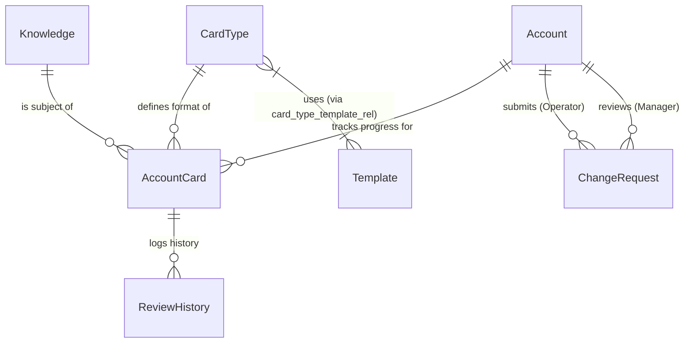

# Database Schema Design

## 1. Overview
The database uses **PostgreSQL 15+** and strictly enforces data integrity via foreign keys and constraints. All timestamps are stored in UTC (`TIMESTAMPTZ`). Internal identifiers are `BIGSERIAL` (i64), while public business identifiers use the immutable `{PREFIX}-{NUMBER}` format.

---

## 2. Core Tables

### 2.1 Knowledge
The central content entity representing a unit of learning (e.g., a vocabulary word, a concept).

| Column | Type | Nullable | Description |
|---|---|---|---|
| `code` | `VARCHAR(20)` | NO | **PK**. Immutable identifier (e.g., `ST-0000001`). |
| `name` | `VARCHAR(255)` | NO | The name or title of the knowledge item. |
| `description` | `TEXT` | NO | Detailed description or definition. |
| `metadata` | `JSONB` | YES | Flexible key-value attributes (e.g., tags, difficulty, category). |
| `created_at` | `TIMESTAMPTZ` | NO | Creation timestamp (default `NOW()`). |
| `updated_at` | `TIMESTAMPTZ` | NO | Last update timestamp (default `NOW()`). |
| `created_by` | `VARCHAR(255)` | YES | User ID/Username of creator. |
| `updated_by` | `VARCHAR(255)` | YES | User ID/Username of last modifier. |

### 2.2 Card Types
Definitions of learning patterns (e.g., "Term -> Definition", "Cloze Deletion").

| Column | Type | Nullable | Description |
|---|---|---|---|
| `code` | `VARCHAR(20)` | NO | **PK**. Immutable identifier (e.g., `ST-0000001`). |
| `name` | `VARCHAR(255)` | NO | Unique name of the card type. |
| `description` | `TEXT` | NO | Description of the learning pattern. |
| `created_at` | `TIMESTAMPTZ` | NO | Creation timestamp. |
| `updated_at` | `TIMESTAMPTZ` | NO | Last update timestamp. |

### 2.3 Templates
Rendering layouts (HTML/Markdown/Component structures) linked to card types.

| Column | Type | Nullable | Description |
|---|---|---|---|
| `code` | `VARCHAR(20)` | NO | **PK**. Immutable identifier. |
| `name` | `VARCHAR(255)` | NO | Unique template name. |
| `description` | `TEXT` | NO | Description of the template. |
| `format` | `VARCHAR(255)` | NO | Format type (e.g., "markdown", "html"). |
| `content` | `BYTEA` | NO | The actual template content. |
| `created_at` | `TIMESTAMPTZ` | NO | Creation timestamp. |
| `updated_at` | `TIMESTAMPTZ` | NO | Last update timestamp. |

### 2.4 Card Type Templates (Relation)
Many-to-many link between Card Types and Templates, defining roles (e.g., "Front", "Back").

| Column | Type | Nullable | Description |
|---|---|---|---|
| `id` | `BIGSERIAL` | NO | **PK**. Internal ID. |
| `card_type_code`| `VARCHAR(20)` | NO | **FK** -> `card_types.code`. |
| `template_code` | `VARCHAR(20)` | NO | **FK** -> `templates.code`. |
| `role` | `VARCHAR(255)` | NO | Usage role (e.g., "front", "back"). |

### 2.5 Accounts
User identities.

| Column | Type | Nullable | Description |
|---|---|---|---|
| `id` | `BIGSERIAL` | NO | **PK**. Internal Account ID. |
| `username` | `VARCHAR(255)` | NO | Unique username. |
| `created_at` | `TIMESTAMPTZ` | NO | Registration timestamp. |
| `updated_at` | `TIMESTAMPTZ` | NO | Last update timestamp. |

### 2.6 Account Cards
The intersection of Account, Knowledge, and Card Type. This table tracks the user's personal learning progress (SM-2 state) for a specific item.

| Column | Type | Nullable | Description |
|---|---|---|---|
| `id` | `BIGSERIAL` | NO | **PK**. Internal Card ID. |
| `account_id` | `BIGINT` | NO | **FK** -> `accounts.id`. |
| `knowledge_code`| `VARCHAR(20)` | NO | **FK** -> `knowledge.code`. |
| `card_type_code`| `VARCHAR(20)` | NO | **FK** -> `card_types.code`. |
| `ease_factor` | `DECIMAL(5,2)`| NO | SM-2 Ease Factor (default ~2.5). |
| `interval_days` | `INTEGER` | NO | Current review interval in days. |
| `repetitions` | `INTEGER` | NO | Consecutive successful reviews. |
| `next_review_date`| `TIMESTAMPTZ` | NO | When the card is next due. |
| `last_reviewed_at`| `TIMESTAMPTZ` | YES | Timestamp of the last review. |
| `created_at` | `TIMESTAMPTZ` | NO | Creation timestamp. |
| `updated_at` | `TIMESTAMPTZ` | NO | Last update timestamp. |

*Constraint*: Unique combination of `(account_id, knowledge_code, card_type_code)`.

### 2.7 Review History
Immutable log of all reviews for analytics and audit trails.

| Column | Type | Nullable | Description |
|---|---|---|---|
| `id` | `BIGSERIAL` | NO | **PK**. Internal History ID. |
| `account_card_id`| `BIGINT` | NO | **FK** -> `account_cards.id`. |
| `quality` | `INTEGER` | NO | User rating (0-5). |
| `reviewed_at` | `TIMESTAMPTZ` | NO | Timestamp of the review. |
| `created_at` | `TIMESTAMPTZ` | NO | Record creation timestamp. |

### 2.8 Change Requests
Staging area for content modifications proposed by Operators.

| Column | Type | Nullable | Description |
|---|---|---|---|
| `id` | `BIGSERIAL` | NO | **PK**. Internal Request ID. |
| `request_type` | `VARCHAR(50)` | NO | `CREATE`, `UPDATE`, or `DELETE`. |
| `target_code` | `VARCHAR(20)` | YES | Code of item being modified (NULL for CREATE). |
| `payload` | `JSONB` | NO | Snapshot of the proposed state. |
| `status` | `VARCHAR(50)` | NO | `PENDING`, `APPROVED`, `REJECTED`. |
| `submitter_id` | `BIGINT` | NO | **FK** -> `accounts.id` (Operator). |
| `reviewer_id` | `BIGINT` | YES | **FK** -> `accounts.id` (Manager). |
| `created_at` | `TIMESTAMPTZ` | NO | Submission timestamp. |
| `updated_at` | `TIMESTAMPTZ` | NO | Last status change timestamp. |

---

## 3. ER Diagram

---

## 4. Sequences

To support immutable code generation, the following sequences are defined:

*   `code_seq_st`: For generating standard items (`ST-XXXXXXX`).
*   `code_seq_cs`: For generating case study/custom items (`CS-XXXXXXX`).